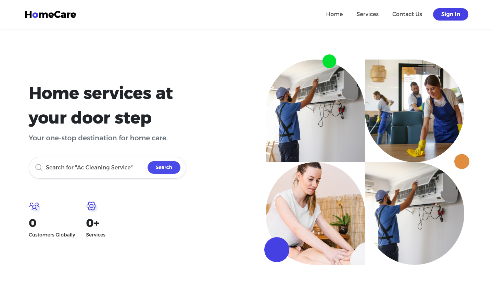
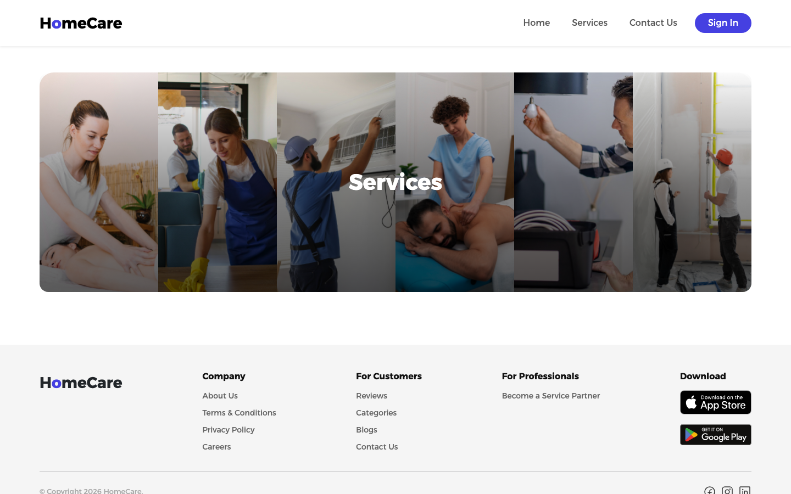
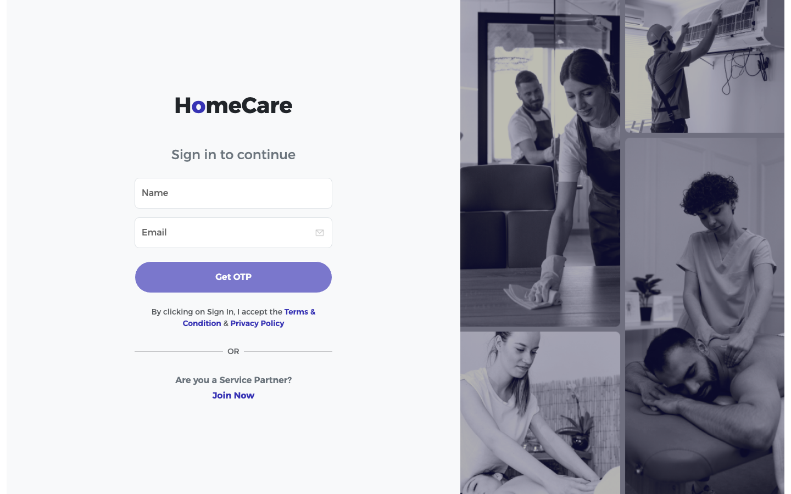
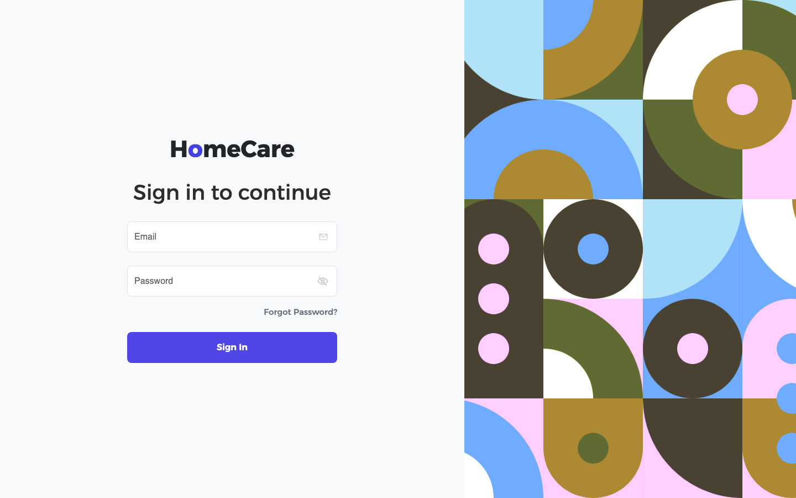

# 🏠 HomeCare — Home Services Booking & Management Platform

> A full-stack web application for booking and managing home services, featuring a customer-facing portal and a comprehensive admin dashboard.

---

## 📸 Screenshots

<table>
  <tr>
    <td align="center"><b>Customer Home</b></td>
    <td align="center"><b>Services Page</b></td>
    <td align="center"><b>Sign In</b></td>
  </tr>
  <tr>
    <td></td>
    <td></td>
    <td></td>
  </tr>
  <tr>
    <td align="center"><b>Admin Login</b></td>
    <td align="center"><b>Service Partners</b></td>
    <td align="center"><b>Payment Transactions</b></td>
  </tr>
  <tr>
    <td></td>
    <td></td>
    <td></td>
  </tr>
</table>

---

## 🚀 Features

### 👤 Customer Portal
| Feature | Description |
|---|---|
| 🏠 Homepage | Browse featured services and categories |
| 🔍 Service Listing | Browse and filter available home services |
| 📋 Service Detail | View service details, pricing, and service partners |
| 🛒 Checkout | Multi-step booking checkout flow |
| 📅 My Bookings | View and manage personal bookings |
| ✅ Booking Success | Booking confirmation with invoice download |
| 👤 Profile | Manage personal profile and addresses |
| 📞 Contact Us | Submit support tickets |
| 🔐 Auth | Register, Login, Forgot/Reset Password |

### 🛠️ Admin Panel
| Feature | Description |
|---|---|
| 📊 Dashboard | Real-time stats — revenue, bookings, customers |
| 📅 Booking Management | View, assign, and manage all bookings |
| 👥 Customers | View and manage registered customers |
| 🧹 Service Management | Add/edit/delete services and categories |
| 🤝 Service Partners | Manage service provider profiles |
| 🎁 Offers | Create and manage discount offers |
| 💳 Payment Transactions | View all payment records |
| 📬 Contact Us | Respond to customer support tickets |
| 📦 Master Data | Manage categories, sub-categories, service types |
| 🤖 AI Chatbot | Built-in admin assistant chatbot |

---

## 🛠️ Tech Stack

### Frontend
- **Framework:** Angular 18 (Standalone Components)
- **Language:** TypeScript
- **Styling:** CSS with custom design system
- **HTTP:** Angular HttpClient with interceptors
- **Real-time:** SignalR (via @microsoft/signalr)

### Backend
- **Framework:** ASP.NET Core (.NET 8)
- **Language:** C#
- **Database:** SQLite (via Entity Framework Core)
- **Authentication:** JWT Bearer Tokens
- **Payment Gateway:** Razorpay
- **Email:** SMTP (Gmail)
- **Real-time:** SignalR Hubs

---

## 📁 Project Structure

```
HomeCare/
├── backend/                        # ASP.NET Core Web API
│   ├── Controllers/                # API Controllers (Auth, Booking, Services, etc.)
│   ├── Models/                     # Entity models
│   ├── DTOs/                       # Data Transfer Objects
│   ├── Data/                       # EF Core DbContext
│   ├── Migrations/                 # EF Core database migrations
│   ├── Hubs/                       # SignalR hubs
│   └── Program.cs                  # App entry point & DI configuration
│
├── frontend/
│   ├── admin/                      # Angular Admin Panel
│   │   └── src/app/modules/
│   │       ├── dashboard/
│   │       ├── booking-management/
│   │       ├── customers/
│   │       ├── service-management/
│   │       ├── service-partners/
│   │       ├── offer/
│   │       ├── payment-transaction/
│   │       ├── contact-us/
│   │       └── master-data/
│   │
│   └── customer/                   # Angular Customer Portal
│       └── src/app/modules/
│           ├── homepage/
│           ├── services/
│           ├── service-listing/
│           ├── service-detail/
│           ├── checkout/
│           ├── my-bookings/
│           ├── booking-success/
│           ├── profile/
│           └── contact-us/
│
└── screenshots/                    # App screenshots
```

---

## ⚙️ Getting Started

### Prerequisites
- [Node.js](https://nodejs.org/) v18+
- [Angular CLI](https://angular.io/cli) v18+
- [.NET 8 SDK](https://dotnet.microsoft.com/download/dotnet/8.0)

### 1. Clone the Repository
```bash
git clone https://github.com/Prince2512v/HomeCare-Home-Services-Booking-Management-Platform.git
cd HomeCare-Home-Services-Booking-Management-Platform
```

### 2. Setup & Run Backend
```bash
cd backend
dotnet restore
dotnet run
```
> Backend runs on: `http://localhost:5045`

### 3. Setup & Run Admin Panel
```bash
cd frontend/admin
npm install
ng serve
```
> Admin panel runs on: `http://localhost:4200`

### 4. Setup & Run Customer Portal
```bash
cd frontend/customer
npm install
ng serve --port 4201
```
> Customer portal runs on: `http://localhost:4201`

### 5. Run Everything at Once (Windows)
```bat
run-all.bat
```

---

## 🔌 API Endpoints

| Module | Base Route |
|---|---|
| Auth | `/api/auth` |
| Bookings | `/api/booking` |
| Services | `/api/services` |
| Service Partners | `/api/servicepartners` |
| Customers | `/api/customer` |
| Offers | `/api/offer` |
| Payments | `/api/payment` |
| Transactions | `/api/transactions` |
| Dashboard | `/api/dashboard` |
| Categories | `/api/category` |
| Support Tickets | `/api/supporttickets` |

---

## 🧑‍💻 Author

**Prince Vasoya**
- GitHub: [@Prince2512v](https://github.com/Prince2512v)

---

## 📄 License

This project was developed as part of a Summer Internship. All rights reserved.
